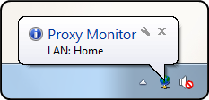
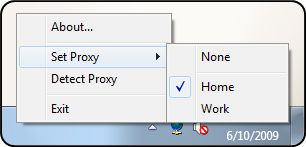

# Proxy Monitor

Proxy Monitor is a small Windows utility that auto detects the proxy servers you are using to access the internet.



## Installation

Before this application can be used, the .NET Framework Version 2.0 must be installed. It is included in recent versions of Windows and available for free through Windows Update.

The application can be installed by just copying it to a destination directory of your choice. Uninstalling is just a matter of deleting the files again - there are no registry settings or other external items that are modified by the application.

## Usage

The application can be started as a regular application, which will make it run as an icon in the system notification area. When started, it will auto-detect the proxy server to use. It will also automatically re-detect the proxy server when the computer's network address has changed.

You can right-click the icon to manually set the proxy server or to trigger an auto-detection.



The application can also be run from the command-line with the /detect flag to auto-detect the proxy and exit immediately (e.g. when the computer starts up).

## Configuration

### General Structure

At the root, the `<proxyConfiguration>` element defines the general Proxy Monitor configuration settings.

Beneath it, the `<proxyServers>` element defines all known proxy servers in separate `<proxyServer>` elements. This group defines your general Local Area Network (LAN) settings that apply to your normal network settings.

If you have additional connections such as dial-up or Virtual Private Network (VPN) connections for which you want to specify different proxy servers, you can optionally define a `<connections>` element, which contains a list of `<connection>` elements that contains the same `<proxyServers>` structure as above.

### Proxy Monitor Configuration

The general Proxy Monitor configuration element `<proxyConfiguration>` has the following attributes:

- `pingTimeout`: the maximum time (in milliseconds) a proxy detection should take; if none of the configured proxy servers has responded within this time, no proxy server is selected. The default is 3000 milliseconds.
- `disableNotifications`: allows you to disable all proxy change notifications (balloon tips) by setting the value to true. The default is false.

### Proxy Servers

Each proxy server (either within or outside a `<connection>` element, but always in a `<proxyServers>` element) must be represented as a `<proxyServer>` element with the following attributes:

- `name`: the friendly name of the proxy server. This will show up in the context menu of the application icon in the notification area.
- `host`: the IP-address or host name of the proxy server.
- `port`: the TCP port to use on the proxy server. The default is port 80.
- `bypassForLocalAddresses`: set to true to bypass the proxy server for local addresses, or false to always use the proxy server. The default is true.
- `bypassList`: set to true to bypass the proxy server for local addresses, or false to always use the proxy server (defaults to true).
- `autoConfigUrl`: set this to the url of an automatic proxy configuration script, if available.
- `command`: the command (DOS command, batch file, ...) to execute if this proxy is used.
- `autoDetectSettings`: set to true to enable the "Automatically Detect Settings" configuration (defaults to false).
- `skipAutoDetect`: skips auto-detection of this proxy server, so that it can only be set manually through the context menu.

Only the name and either the host or autoConfigUrl attributes are mandatory.

### Connections

Each connection must be represented as a `<connection>` element with the following attributes:

- `name`: the name of the connection as defined in the Internet Options dialog of your system (this must be exactly the same name).
- `detectionDelay`: the time in milliseconds to wait before starting detection of the proxy servers in this connection. This can be useful if you have a connection that takes a while to get set up before the proxy servers become "visible" (e.g. VPN networks with security checks that take some time to complete).
- `skipAutoDetect`: skips auto-detection of all proxy servers in this connection, so that they can only be set manually through the context menu.

Important to note is that the connections are checked in sequence, so if you have a connection with a detection delay then the next connection won't be checked until after the delay and the detection have completed.

## Example Configuration

A sample configuration file looks as below.

It defines two different proxy servers for the LAN: a **Home** and a **Work** proxy server. The **Home** proxy is on a machine called `homeproxy` at port 8080. The **Work** proxy has an automatic configuration script located at `http://workproxy/autoconfig.pac` and if this one is detected, a `ConnectToShares` batch file is executed.

A separate connection is also defined for a Virtual Private Network (VPN) connection. It has a proxy server specific to the VPN connection, and an alternative proxy server that is not automatically detected but can be manually selected if needed for some reason. The automatic detection is delayed for 5 seconds to allow a security check to complete.

```xml
<?xml version="1.0" encoding="utf-8" ?>
<configuration>
  <configSections>
    <section name="proxyConfiguration"
      type="ProxyMonitor.Configuration.ProxyConfiguration, ProxyMonitor" />
  </configSections>
  <proxyConfiguration pingTimeout="3000" disableNotifications="false">
    <proxyServers>
      <proxyServer name="Home"
        host="homeproxy"
        port="8080"
        bypassForLocalAddresses="true"
        bypassList="server1;server2" />
      <proxyServer name="Work"
        autoConfigUrl="http://workproxy/autoconfig.pac"
        command="ConnectToShares.bat" />
    </proxyServers>
    <connections>
      <connection name="VPN" detectionDelay="5000">
        <proxyServers>
          <proxyServer name="VPN Work"
            autoConfigUrl="http://workproxy/vpn_proxy.pac"
            autoDetectSettings="true" />
          <proxyServer name="VPN Work (Alternate)"
            autoConfigUrl="http://workproxy/vpn_proxy_alt.pac"
            autoDetectSettings="true"
            skipAutoDetect="true" />
        </proxyServers>
      </connection>
    </connections>
  </proxyConfiguration>
</configuration>
```

## How It Works

When the application is started or when the network address has changed, each configured proxy server is checked to see if it is available by attempting to download the `autoConfigUrl` or by sending a ping command to the host machine. When the download succeeded or a ping reply is received, the proxy server will be used and optionally the command is executed.

If you have also defined connections, the same process is followed but any detected proxy server will only be set for the specified connection.

## What's New?

### v1.4 (February 14, 2013)

- Added support for the "Automatically Detect Settings" configuration.

### v1.3 (October 11, 2009)

- Thanks to David Huntley, the proxy servers are now set using the proper Windows API's instead of writing directly to the registry. This means that setting the proxy now works properly under all circumstances. Thanks a million David!
- Also added by David Huntley is the support for connections, so you can specify proxy servers for specific connections such as dial-up or VPN connections.
- The ping timeout setting is now used to control the timeout for the entire proxy detection. Previously, it was only used for an actual ping request but even in that case, it did not include a 15 second timeout for a DNS query. So now the entire check is guarded with a timeout.
- The proxy detection is now performed on a background thread so the user interface is not blocked.
- For troubleshooting purposes, information and error messages are now logged to a `ProxyMonitor.log` file (which is configurable in the `ProxyMonitor.exe.config` file).

### v1.2 (September 8, 2008)

- Added the `skipAutoDetect` attribute to support proxies that are only set manually.
- Fixed the bug where Internet Explorer would override the proxy settings again (at random) to their previous values.

### v1.1.0 (September 9, 2007)

- Added the `bypassList` attribute to support the proxy bypass list.
- Added the `disableNotifications` attribute to allow disabling notifications (balloon tips).

### v1.0.60905 (September 5, 2006)

- The configured proxy servers are now checked in parallel to speed up proxy detection.

### v1.0.60807 (August 7, 2006)

- A custom command can now be executed when the proxy server is set.

### v1.0.60805 (August 5, 2006)

- Besides pinging the host, the `autoConfigUrl` attribute of the `proxyServer` element is now used to determine if the proxy server is reachable by attempting a download of the configuration script.
- As a result, the `host` attribute of the `proxyServer` element is now optional.
- When starting the application with the `/detect` flag to auto-detect the proxy server and exit immediately, a notification is still shown to indicate which proxy server was set.
- Better exception handling.

### v1.0.60802 (August 2, 2006)

- Initial Release.
